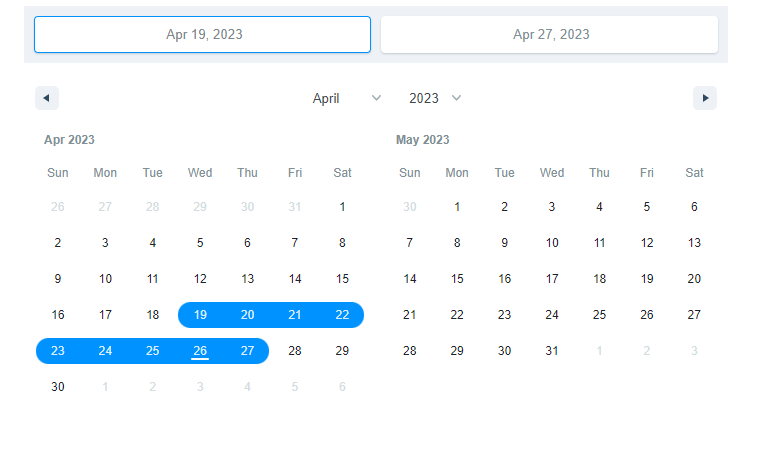
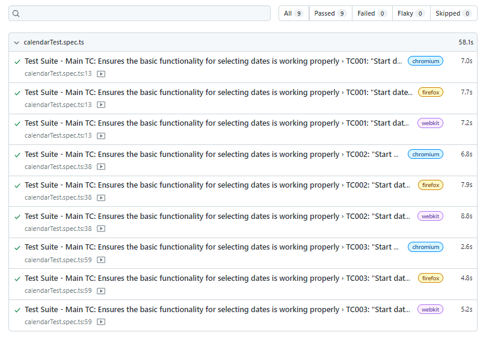
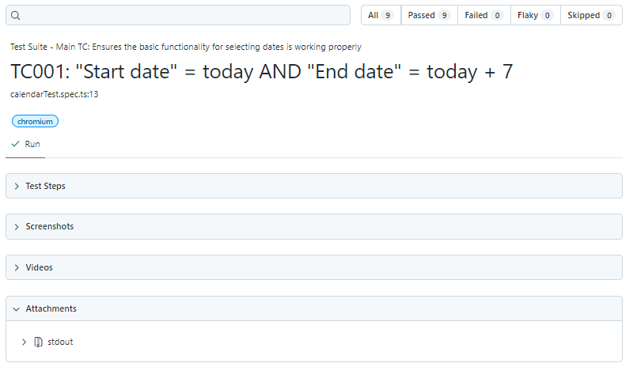

# Calendar Automated UI Tests
> Automatic UI tests for a calendar in a web app. The tested web page consists of two calendars that visually display the days between 2 selected dates.

## Table of contents
* [General Info](#general-info)
* [Technologies](#technologies)
* [Setup](#setup)
* [Launch](#launch)
* [Other Recommended Commands](#other-recomended-comands)
* [Reporter Screenshots](#reporter-screenshots)
* [Report of all test](#all-test-report)
* [Detail of one test](#detail-test-report)
* [Project Status](#project-status)

## General Info
This proyect is about automated UI tests with Playwright and Typescript, using the design pattern POM (page object model). This proyect include EsLint for linting. The system tested is a calendar web app in which 2 dates can be selected using 1 or two calendars displayed.

## Technologies
Project is created with:

- Node.js v16.15.1.
- Typescript v4.9.5.
- Playwright.
- ESLint v8.38.0 (manual setup started with npm install --save-dev eslint @typescript-eslint/parser @typescript-eslint/eslint-plugin).
- Typescript-eslint/eslint-plugin v5.59.0.
- Typescript-eslint/parser v5.59.0.

## Setup
Clone this repo to desktop (or other place) and run `npm install` to install all the dependencies. After that `run npx playwright install` to install the browsers that Playwright use to run the tests.

## Launch
After you clone this repo to your desktop (or other place), go to its root directory and run npm install to install its dependencies.

Once the dependencies are installed, you can run some of this commands:

- `npm run test`: it is used to run the "npx playwright test calendarTest.spec.ts" command (this is configured in package.json file), which will execute all the tests described in the "calendarTest.spec.ts" file in the Chrome, Firefox and Webkit browsers.
- `npx playwright test calendarTest.spec.ts --headed`: it is used to run tests with the browser in headed mode.
- `npx playwright test calendarTest.spec.ts --project=chromium`: it is used to run the test only in the browser chrome.
- `npx playwright test calendarTest.spec.ts --project=chromium --headed`: it is used to run the test only in the browser chrome and in headed mode.

### Other Recommended Commands:

- "npm run lint": it is used to run the command "eslint . --ext .ts" (this is configured in package.json file), this will make a review of the code in the entire project, indicating errors or warnings corresponding to what is defined by ESLint and the rules that have been added in the ".eslintrc" file.
- "npm run lint.fix": it is used to execute the command "eslint . --ext .ts --fix" (this is configured in package.json file), which will apply an automatic code correction based on the errors found by ESLint.

## Reporter Screenshots
After running the test a HTML report will be generated, to see it run the command `npx playwright show-report`. Here are some screenshots of the report:
### Report of all test

### Detail of one test

## Project Status
Project is: _in progress_ 

